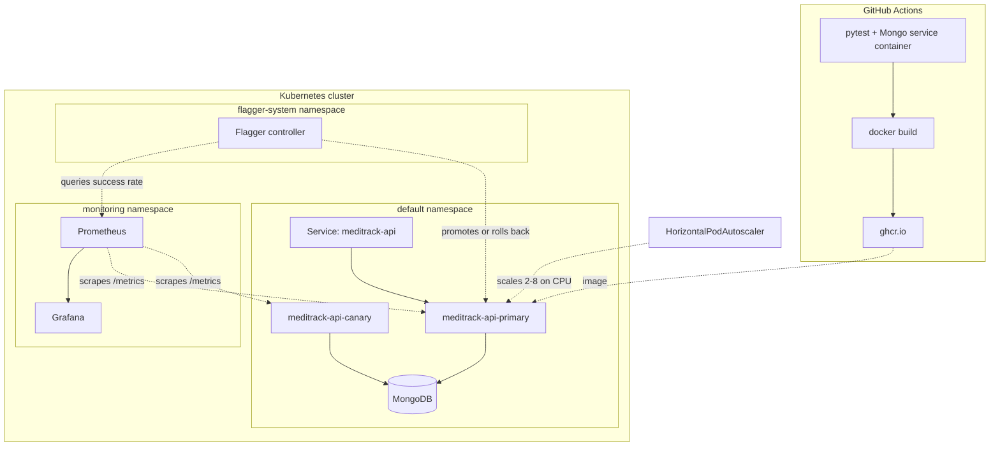

# MediTrack Cloud

A hospital appointment booking API built as a production-shaped Kubernetes platform: health probes wired to real failure semantics, horizontal autoscaling, progressive delivery with automated rollback, infrastructure as code, and CI/CD with no stored credentials.

**Scope note:** the runtime was built and verified on a local `kind` cluster. The Terraform modules target AWS EKS and are validated with `terraform validate` and `terraform fmt`, but have not been applied — a NAT gateway per availability zone plus the EKS control plane costs roughly $130/month, so the cloud layer is written and checked rather than run.

## Stack

| Layer | Choice | Why |
|---|---|---|
| API | FastAPI + Motor | Async throughout; a blocking driver would stall the event loop |
| Database | MongoDB | Unique index enforces booking constraints atomically |
| Orchestration | Kubernetes (kind locally, EKS in Terraform) | |
| Packaging | Helm | One chart, per-environment values, release-level rollback |
| IaC | Terraform | Custom VPC, private-subnet nodes, IRSA, S3 state with DynamoDB locking |
| CI/CD | GitHub Actions | Tests against a real Mongo; publishes to GHCR |
| Observability | Prometheus + Grafana | ServiceMonitor-based discovery |
| Progressive delivery | Flagger | Canary analysis against Prometheus, automatic rollback |

## Architecture



### Progressive delivery fails closed

Flagger owns the rollout: it creates `meditrack-api-primary` as the live version and treats your Deployment as a template. On each new revision it runs canary analysis against Prometheus and either promotes or rolls back.

A canary whose success-rate metric returned no data:

```
New revision detected! Scaling up meditrack-api.default
Starting canary analysis for meditrack-api.default
Advance meditrack-api.default canary iteration 1/4
Halt advancement no values found for kubernetes metric request-success-rate
Halt advancement no values found for kubernetes metric request-success-rate
Rolling back meditrack-api.default failed checks threshold reached 2
Canary failed! Scaling down meditrack-api.default
```

Absence of evidence was treated as failure, not as permission. The primary served continuously throughout — 45 minutes, zero restarts — across several rejected rollouts.

## Design decisions

**MongoDB runs as a Deployment with `emptyDir`.** Wrong for production: a database needs a StatefulSet with PersistentVolumeClaims for stable identity and durable storage, or a managed service. Chosen here because storage-class plumbing would add complexity without teaching anything about the rest of the platform.

**The app fails fast when Mongo is unreachable at startup.** `create_indexes()` runs in the lifespan handler and an exception there kills the process. In Kubernetes that surfaces as CrashLoopBackOff with exponential backoff, so pods can stay down for minutes after the database recovers. Starting unready and letting the readiness probe gate traffic would recover in seconds without a restart. Both behaviours were observed in this cluster.

**Worker nodes sit in private subnets.** A subnet is "public" only because its route table points at an internet gateway — there is no flag. Nodes route outbound through a NAT gateway, which permits egress without allowing inbound connections. One NAT per availability zone, because a shared NAT is a single point of failure.

**No long-lived cloud credentials anywhere.** Pods assume IAM roles through IRSA via the cluster's OIDC provider; GitHub Actions authenticates to AWS through OIDC role assumption and to GHCR with a per-run token. Node-role credentials would be shared by every pod on the node.

**Images are tagged by commit SHA as well as `latest`.** A mutable tag can't identify an artifact after the fact, which makes rollback guesswork.

**Nodes use SPOT capacity.** Roughly 70% cheaper, and acceptable for stateless API pods. Wrong for the database.
## What this demonstrates

### Liveness and readiness answer different questions

`/health/live` never touches the database. `/health/ready` pings Mongo and returns **503** when it can't reach it — Kubernetes reads the status code, not the body, so returning 200 with an error message would keep routing traffic to a broken pod.

Verified by stopping MongoDB while the API ran:

```
$ kubectl scale deployment mongo --replicas=0

$ kubectl get pods
meditrack-api-57m6v   0/1   Running   RESTARTS 0   4m50s
meditrack-api-mf27t   0/1   Running   RESTARTS 0   4m43s

$ kubectl get endpoints meditrack-api
NAME            ENDPOINTS
meditrack-api               <- empty
```

Pods left the Service but were **not restarted** — restarting doesn't fix a database. When Mongo returned they rejoined automatically, restart count still zero.

### Autoscaling is a feedback controller, not a threshold trigger

```
cpu: 4%/50%     REPLICAS 2   idle
cpu: 68%/50%    REPLICAS 2   load arrives
cpu: 170%/50%   REPLICAS 3   first scale-up
cpu: 168%/50%   REPLICAS 7   target recalculated
cpu: 37%/50%    REPLICAS 7   overshoot
cpu: 51-53%/50% REPLICAS 8   steady state at maxReplicas
```

The HPA computes `ceil(replicas × current / target)` rather than stepping one pod at a time. `stabilizationWindowSeconds: 60` on scale-down prevents flapping: scale up fast, scale down slow.

### Double-booking is prevented at the database, not in the handler

A check-then-insert in the API is a race: with two pods, both can read "slot free" before either writes. The constraint is a unique index on `{doctor_id, slot}`; the handler catches `DuplicateKeyError` and returns 409. Correctness holds at any replica count.


## Running it locally

Requires Docker, kubectl, kind, and Helm.

```bash
kind create cluster --name meditrack --config kind-config.yaml
docker build -t meditrack-api:0.2.0 .
kind load docker-image meditrack-api:0.2.0 --name meditrack
```

Monitoring first — the chart's ServiceMonitor needs the Prometheus operator's CRDs to exist:

```bash
helm repo add prometheus-community https://prometheus-community.github.io/helm-charts
helm install monitoring prometheus-community/kube-prometheus-stack \
  --namespace monitoring --create-namespace \
  --set prometheus.prometheusSpec.retention=2h \
  --set alertmanager.enabled=false
```

Then the application:

```bash
helm install meditrack ./meditrack-chart --set image.tag=0.2.0
kubectl port-forward svc/meditrack-api 8080:80
```

API docs at `http://localhost:8080/docs`.

Optional — progressive delivery:

```bash
helm repo add flagger https://flagger.app
kubectl apply -f https://raw.githubusercontent.com/fluxcd/flagger/main/artifacts/flagger/crd.yaml
helm install flagger flagger/flagger --namespace flagger-system --create-namespace \
  --set metricsServer=http://monitoring-kube-prometheus-prometheus.monitoring:9090 \
  --set meshProvider=kubernetes
helm install flagger-loadtester flagger/loadtester --namespace flagger-system
```

## Tests

```bash
pytest -v
```

Six tests covering health probes, booking creation, the 409 duplicate-slot path, and input validation. They run against a real MongoDB rather than a mock — the duplicate-slot test exercises the actual unique index, which a mock could not verify. CI provides Mongo as a service container.

The test client uses `LifespanManager`, because `ASGITransport` calls routes directly and never triggers FastAPI's startup events — without it the database client is never created and every test touching Mongo fails.

## Known limitations

- **Canary promotion is unverified.** Rollback works and is demonstrated above, but no canary has been promoted successfully: the ServiceMonitor's selector does not cover Flagger's canary pods, so the success-rate query returns no data and the analysis fails closed. Fixing the selector and the load-test webhook is the next step.
- **MongoDB uses ephemeral storage.** Data does not survive pod restarts.
- **Grafana ships with a default password.** Set via `--set` for local use only.
- **Terraform has never been applied.** Validated only.
- **Datetime handling is inconsistent.** Booking slots are stored as naive datetimes while `created_at` carries a UTC offset.
- **`replicas` in the chart conflicts with the HPA.** Each `helm upgrade` resets the replica count the HPA has set.

## Planned

- Natural-language booking endpoint backed by an LLM (`POST /bookings/parse`)
- Structured logging with Loki
- Fix the canary metrics gap and demonstrate an automated promotion